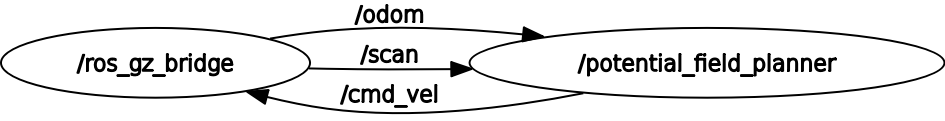
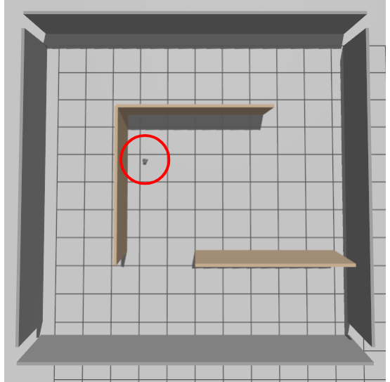
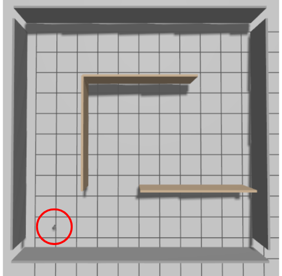
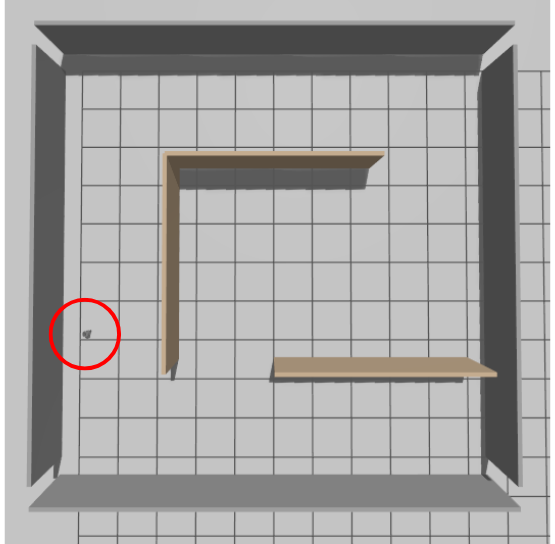
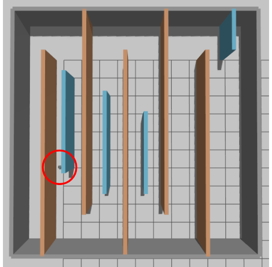
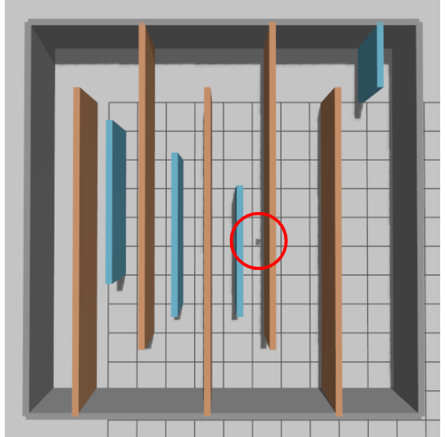
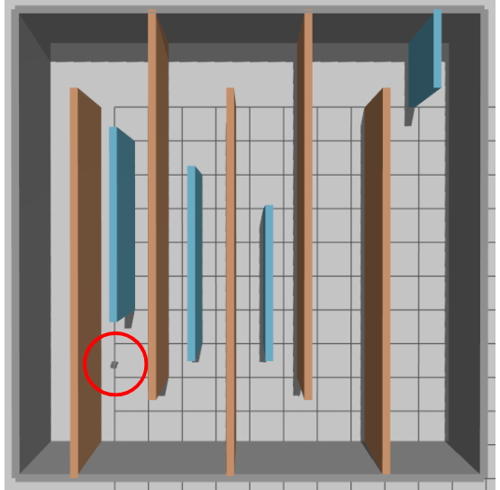

# ROS 2 Maze Navigation with TurtleBot3 Burger

Autonomous maze navigation project built with **ROS 2 Jazzy**, **Gazebo Harmonic**, **ros_gz_bridge**, and **TurtleBot3 Burger**.  
The project implements a **Potential Field** planner for the base maze and an extended **wall-following escape strategy** for the bonus complex maze.

## Project Overview

This project was developed for a ROS 2 robot simulation course. The robot is spawned inside a Gazebo maze, receives **LiDAR** and **odometry** through `ros_gz_bridge`, and publishes `TwistStamped` velocity commands on `/cmd_vel` to navigate toward a goal while avoiding collisions.

Two navigation modes were implemented:

- **Base project:** Potential Field navigation in `simple_maze.world`
- **Bonus challenge:** Potential Field + local-minima escape strategy in `complex_maze.world`

## Features

- ROS 2 Jazzy + Gazebo Harmonic integration
- TurtleBot3 Burger simulation pipeline
- Bridging of `/clock`, `/odom`, `/scan`, and `/cmd_vel`
- Potential Field attractive + repulsive force navigation
- Invalid LiDAR filtering for `0.0`, `inf`, and `nan`
- Odometry-based stopping condition with **0.20 m tolerance**
- Bonus local-minima escape using **wall-following recovery**
- Separate launch/planner files for base and bonus paths

## Robot, Worlds, and Defaults

### Robot

- **Platform:** TurtleBot3 Burger
- **Drive type:** Differential drive

### Simulator and Middleware

- **ROS 2:** Jazzy
- **Simulator:** Gazebo Harmonic / `ros_gz`

### Worlds

- **Base world:** `simple_maze.world`
- **Bonus world:** `complex_maze.world`

### Default base configuration

- **Spawn:** `(0.5, 0.5)`
- **Goal:** `(9.0, 9.0)`

### Default bonus configuration

- **Spawn:** `(0.6, 0.6)`
- **Goal:** `(11.4, 11.4)`

## Repository Structure

This repository contains the custom `maze_navigation` package.

```text
maze_navigation/
├── launch/
│   ├── maze_sim.launch.py
│   └── maze_bonus.launch.py
├── maze_navigation/
│   ├── potential_field_planner.py
│   └── potential_field_bonus_planner.py
├── worlds/
│   ├── simple_maze.world
│   └── complex_maze.world
└── package.xml / setup.py / setup.cfg ...
```

### Main files

- `launch/maze_sim.launch.py` — launches the base/simple maze
- `launch/maze_bonus.launch.py` — launches the bonus/complex maze
- `maze_navigation/potential_field_planner.py` — base Potential Field planner
- `maze_navigation/potential_field_bonus_planner.py` — bonus planner with escape behavior
- `worlds/simple_maze.world` — base maze world
- `worlds/complex_maze.world` — bonus maze world

## Prerequisites

Tested on:

- Ubuntu 24.04
- WSL Ubuntu 24.04
- ROS 2 Jazzy
- Gazebo Harmonic

You should already have:

- ROS 2 Jazzy installed
- Gazebo Sim installed
- GUI support working if using WSL

## Required Dependencies

Install the required ROS / Gazebo packages:

```bash
sudo apt update
sudo apt install -y \
  ros-jazzy-ros-gz \
  ros-jazzy-dynamixel-sdk
```

## Setup and Launch Instructions

### Step 1: Create a ROS 2 workspace

```bash
mkdir -p ~/ros2_project_ws/src
cd ~/ros2_project_ws/src
```

### Step 2: Clone this repository

```bash
git clone https://github.com/WalidAlsafadi/ros2-maze-navigation.git maze_navigation
```

### Step 3: Clone the required TurtleBot3 repositories

```bash
git clone -b jazzy https://github.com/ROBOTIS-GIT/turtlebot3_msgs.git
git clone -b jazzy https://github.com/ROBOTIS-GIT/turtlebot3.git
git clone -b jazzy https://github.com/ROBOTIS-GIT/turtlebot3_simulations.git
```

### Step 4: Install workspace dependencies

```bash
cd ~/ros2_project_ws
source /opt/ros/jazzy/setup.bash
rosdep install --from-paths src --ignore-src -r -y
```

### Step 5: Build the workspace

```bash
cd ~/ros2_project_ws
source /opt/ros/jazzy/setup.bash
colcon build --symlink-install
```

### Step 6: Source the workspace

```bash
source /opt/ros/jazzy/setup.bash
source ~/ros2_project_ws/install/setup.bash
export TURTLEBOT3_MODEL=burger
```

### Step 7: Launch the base project

```bash
ros2 launch maze_navigation maze_sim.launch.py
```

### Step 8: Launch the bonus project

```bash
ros2 launch maze_navigation maze_bonus.launch.py
```

## Quick Start

If you want the shortest working flow:

```bash
mkdir -p ~/ros2_project_ws/src
cd ~/ros2_project_ws/src
git clone https://github.com/WalidAlsafadi/ros2-maze-navigation.git maze_navigation
git clone -b jazzy https://github.com/ROBOTIS-GIT/turtlebot3_msgs.git
git clone -b jazzy https://github.com/ROBOTIS-GIT/turtlebot3.git
git clone -b jazzy https://github.com/ROBOTIS-GIT/turtlebot3_simulations.git
cd ~/ros2_project_ws
source /opt/ros/jazzy/setup.bash
rosdep install --from-paths src --ignore-src -r -y
colcon build --symlink-install
source ~/ros2_project_ws/install/setup.bash
export TURTLEBOT3_MODEL=burger
ros2 launch maze_navigation maze_sim.launch.py
```

## Base Project Configuration

### Default base launch

```bash
ros2 launch maze_navigation maze_sim.launch.py
```

Equivalent explicit command:

```bash
ros2 launch maze_navigation maze_sim.launch.py \
  world:=simple_maze.world \
  spawn_x:=0.5 \
  spawn_y:=0.5 \
  goal_x:=9.0 \
  goal_y:=9.0
```

### Custom base goal example

```bash
ros2 launch maze_navigation maze_sim.launch.py goal_x:=8.0 goal_y:=8.5
```

### Custom base spawn example

```bash
ros2 launch maze_navigation maze_sim.launch.py spawn_x:=1.0 spawn_y:=1.0 goal_x:=9.0 goal_y:=9.0
```

## Bonus Project Configuration

### Default bonus launch

```bash
ros2 launch maze_navigation maze_bonus.launch.py
```

This uses:

- `world:=complex_maze.world`
- `spawn_x:=0.6`
- `spawn_y:=0.6`
- `goal_x:=11.4`
- `goal_y:=11.4`

### Bonus debug example with a custom spawn

```bash
ros2 launch maze_navigation maze_bonus.launch.py spawn_x:=1.8 spawn_y:=9.8
```

### Basic planner on the complex maze

```bash
ros2 launch maze_navigation maze_sim.launch.py \
  world:=complex_maze.world \
  spawn_x:=0.6 \
  spawn_y:=0.6 \
  goal_x:=11.4 \
  goal_y:=11.4
```

## How the System Works

### Base planner

The base planner uses the **Potential Field method**:

- **Attractive force** pulls the robot toward the goal
- **Repulsive force** pushes the robot away from nearby obstacles detected by LiDAR
- The combined force determines the desired heading and forward velocity

### Bonus planner

The complex maze exposed local-minimum behavior, so the bonus planner extends the base idea with:

- dynamic wall-follow side selection
- local-minima escape using wall-following
- late-maze detachment logic to resume goal-seeking safely

## Invalid LiDAR Handling

LiDAR readings such as:

- `0.0`
- `inf`
- `nan`

are filtered and replaced with a safe fallback distance before they are used in navigation calculations. This prevents unstable force values and avoids division-by-zero issues.

## Bridge Configuration

`ros_gz_bridge` is used to connect Gazebo with ROS 2.

### Bridged topics

- `/clock`
- `/odom`
- `/scan`
- `/cmd_vel`

These topics allow the planner to:

- read odometry
- read LiDAR scans
- publish robot velocity commands
- stay synchronized with simulation time

### ROS Graph

The following ROS graph shows the main runtime communication in the project.  
`/ros_gz_bridge` publishes `/odom` and `/scan` to the planner, while the planner publishes `/cmd_vel` back through the bridge to Gazebo.



## Results Summary

### Base maze

- **World:** `simple_maze.world`
- **Start:** `(0.5, 0.5)`
- **Goal:** `(9.0, 9.0)`
- **Stopping rule:** within `0.20 m` of the goal using odometry

Example successful base runs:

- Run 1: `Goal reached. Final pose=(8.55, 8.36), goal=(8.50, 8.50), dist=0.150`
- Run 2: `Goal reached. Final pose=(8.54, 8.36), goal=(8.50, 8.50), dist=0.150`
- Run 3: `Goal reached. Final pose=(8.61, 8.40), goal=(8.50, 8.50), dist=0.150`

### Bonus maze

- **World:** `complex_maze.world`
- **Start:** `(0.6, 0.6)`
- **Goal:** `(11.4, 11.4)`
- **Stopping rule:** within `0.20 m` of the goal using odometry

Example successful bonus runs:

- Run 1: `Goal reached. Final pose=(10.79, 10.60), goal=(10.80, 10.80), dist=0.197`
- Run 2: `Goal reached. Final pose=(10.65, 10.69), goal=(10.80, 10.80), dist=0.188`
- Run 3: `Goal reached. Final pose=(10.78, 10.62), goal=(10.80, 10.80), dist=0.186`

## Demo Snapshots

<table>
  <tr>
    <td align="center">
      <br>
      <sub>Base Run 1</sub>
    </td>
    <td align="center">
      <br>
      <sub>Base Run 2</sub>
    </td>
    <td align="center">
      <br>
      <sub>Base Run 3</sub>
    </td>
  </tr>
</table>

<table>
  <tr>
    <td align="center">
      <br>
      <sub>Bonus Run 1</sub>
    </td>
    <td align="center">
      <br>
      <sub>Bonus Run 2</sub>
    </td>
    <td align="center">
      <br>
      <sub>Bonus Run 3</sub>
    </td>
  </tr>
</table>

## Requirement Coverage

### Base project

This repository covers the required base items:

- robot selection and integration using TurtleBot3 Burger
- Gazebo maze environment setup
- `ros_gz_bridge` configuration for `/scan`, `/odom`, `/cmd_vel`, and `/clock`
- Potential Field attractive and repulsive force navigation
- invalid LiDAR handling
- odometry-based stop condition within **0.2 m** of the goal

### Bonus challenge

This repository also includes an optional bonus solution that covers:

- loading and running `complex_maze.world`
- demonstrating failure of a basic planner in local-minimum situations
- implementing a working escape strategy using wall-following recovery
- successful navigation from start to goal in the complex maze

## Notes on Evaluation and Final Stopping Position

- Goal completion is evaluated using the robot's **odometry position**
- The final stopping position may vary slightly between runs because of simulation timing, wheel slip, and odometry drift
- Small visual differences in the Gazebo top view are acceptable as long as the robot stops within the required goal tolerance
- In both base and bonus testing, the terminal output is reported in the planner's **internal odometry frame**, while the official start and goal positions remain defined in the world frame

## Troubleshooting

### `ros_gz_bridge` or `ros_gz_sim` not found

Install:

```bash
sudo apt install ros-jazzy-ros-gz
```

### `dynamixel_sdk` missing during build

Install:

```bash
sudo apt install ros-jazzy-dynamixel-sdk
```

### Gazebo opens but the robot does not move

Check that:

- the workspace built successfully
- both setup files were sourced
- `TURTLEBOT3_MODEL=burger` is exported
- the planner node is running
- the bridge is running correctly

### New launch file or Python changes do not seem applied

Rebuild and source again:

```bash
cd ~/ros2_project_ws
source /opt/ros/jazzy/setup.bash
colcon build --packages-select maze_navigation --symlink-install
source ~/ros2_project_ws/install/setup.bash
```

### Simulation feels slow on WSL

This project was tested on WSL Ubuntu 24.04. Gazebo performance may be slower depending on hardware, GPU support, and Windows graphics configuration. This may affect visualization smoothness but does not necessarily affect the correctness of the navigation logic.

## Engineering Highlights

From a technical perspective, this project demonstrates:

- ROS 2 workspace setup and dependency integration
- simulator-to-ROS topic bridging with `ros_gz_bridge`
- real-time sensor processing
- Potential Field local planning
- practical handling of invalid LiDAR readings
- debugging around odometry drift and simulation physics
- recovery-strategy design for local-minimum situations in a complex maze

## Future Improvements

- stronger local-minima escape methods beyond wall-following
- cleaner visualization and debugging overlays
- more systematic parameter search
- improved localization using sensor fusion instead of odometry only
- richer experiment logging and benchmarking

## Acknowledgment

This work builds on the starter skeleton provided in **DSAI 4304: Robot Simulation** by **Dr. Marwan Radi**. The provided skeleton served as the initial foundation for the package structure and project setup, while the ROS 2 launch integration, Gazebo bridging, TurtleBot3 setup, Potential Field navigation logic, bonus recovery strategy, testing, and documentation were completed in this implementation.
